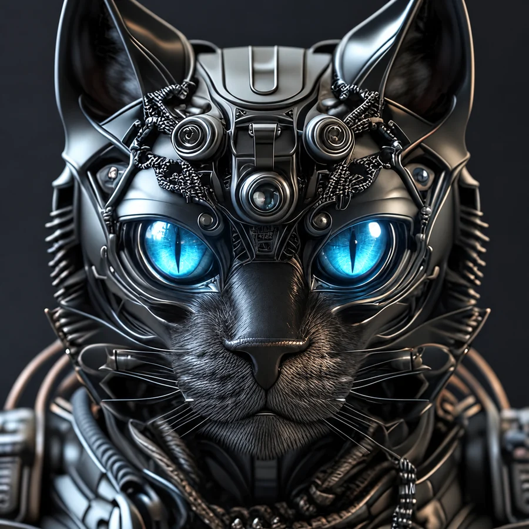

<p align="center">
  
</p>

# HAL 4E4 · Showcase

**A local-first AI partner with voice, expressive avatars, contextual memory and real tools.**

HAL 4E4 is Guido's evolving personal AI workspace. It combines natural conversation with creative rendering, desktop workflows, structured knowledge and a broker-verified **DEMO-only** trading cockpit.

[**Open the interactive showcase →**](https://maxvector-berlin.github.io/HAL-Showcase/)

## One assistant, three characters

| HAL | Milo | Catbot |
|:---:|:---:|:---:|
|  |  |  |
| Calm and natural | Bright and playful | Precise and robotic |

Each avatar pack brings its own facial states, German visemes, idle behavior and matching multilingual voice direction. The visible character changes while the connected assistant remains consistent.

## What HAL connects

- **Voice and character performance** — speech recognition, multilingual TTS, avatar-specific voices, timed visemes, blinking and contextual facial expressions.
- **Creative AI cockpit** — ComfyUI workflows, model and LoRA selection, seeds, formats, pic-to-pic, three-prompt selection and render history.
- **Video workflows** — Krea model selection, image-to-video, cost preview, progress, playback and download.
- **Context and dossiers** — recent conversation plus structured knowledge about people, projects, places and ongoing topics.
- **Desktop and Photoshop bridge** — launch configured applications, prepare Photoshop documents and open selected render results.
- **Vision and files** — analyze screenshots, images, text, code and multiple uploaded files together.
- **Transparent API costs** — daily usage ledger by task, endpoint and model.
- **Capital.com DEMO cockpit** — broker reconciliation, spread guards, reservations, risk limits, stops, targets, timed exits and trade statistics.

## Request flow

```text
voice / text
    ↓
intent + tone
    ↓
recent context + relevant dossiers
    ↓
specialized tool or workflow
    ↓
one coherent response
    ↓
voice + visemes + facial performance
```

Example:

> “HAL, make me three prompts for a futuristic flying car and let me choose.”

HAL returns three prompt cards. Guido chooses `1`, `2`, `3`, a subset or all. Only then does the selected workflow open with image size, aspect ratio and seed controls.

## Project principles

1. **Local** — private configuration and operational state stay on the user's system.
2. **Visible** — actions, costs, render progress and broker results remain inspectable.
3. **Modular** — characters and focused tools can evolve independently.
4. **Human** — the interface stays understandable, collaborative and occasionally funny.

## Safety and privacy

This repository is a visual showcase. It contains **no API keys, broker credentials, databases, account state, private memory or runtime logs**. The trading integration described here is restricted to Capital.com **DEMO** mode.

---

**Team 4E4** · People · Ideas · AI · Real Impact
