<p align="center">
  
</p>

# HAL 4E4 · Showcase

**A local-first AI partner with voice, expressive avatars, contextual memory and real tools.**

HAL 4E4 is Guido's evolving personal AI workspace. It combines natural conversation with creative rendering, desktop workflows, structured knowledge and a broker-verified **DEMO-only** trading cockpit.

[**Open the interactive showcase →**](https://maxvector-berlin.github.io/HAL-Showcase/)

## One assistant, three characters

| HAL | Milo | Catbot |
|:---:|:---:|:---:|
|  |  |  |
| Calm and natural | Bright and playful | Precise and robotic |

Each avatar pack brings its own facial states, German visemes, idle behavior and matching multilingual voice direction. The visible character changes while the connected assistant remains consistent.

## What HAL connects

- **Voice and character performance** — speech recognition, multilingual TTS, avatar-specific voices, timed visemes, blinking and contextual facial expressions.
- **Creative production cockpit** — ComfyUI workflows, PictoFlux2, the 18-state Avatar Factory, model and LoRA selection, seeds, formats, pic-to-pic and render history.
- **Video and animation** — MiniMax H3 text-to-video, image-to-video and first/last-frame animation with native stereo audio, presets and visible model controls.
- **Context and dossiers** — recent conversation plus structured knowledge about people, projects, places and ongoing topics.
- **Desktop and Photoshop bridge** — launch configured applications, prepare Photoshop documents and open selected render results.
- **Vision and files** — analyze screenshots, images, text, code and multiple uploaded files together.
- **Transparent API costs** — daily usage ledger by task, endpoint and model.
- **Capital.com DEMO cockpit** — broker reconciliation, spread guards, reservations, risk limits, stops, targets, timed exits and trade statistics.

## Voice becomes character performance

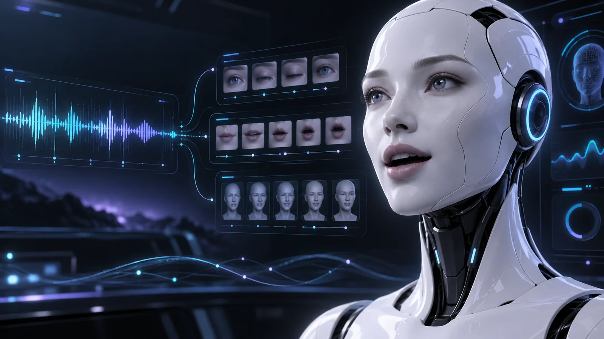

HAL's spoken answer is paired with a visual performance:

1. Input arrives through push-to-talk or text.
2. Pronunciation cleanup keeps names such as **HAL** and **Milo** consistent.
3. The active avatar chooses its own German or English voice direction.
4. A timing sidecar maps speech into visible mouth groups and real pauses.
5. Facial logic adds blinking, thought, amusement and subtle idle behavior.

The avatar window can be resized, moved, snapped to screen edges and kept on top. HAL, Milo and Catbot use the same engine with different image and voice packs.

## Creative pipeline with a real decision point

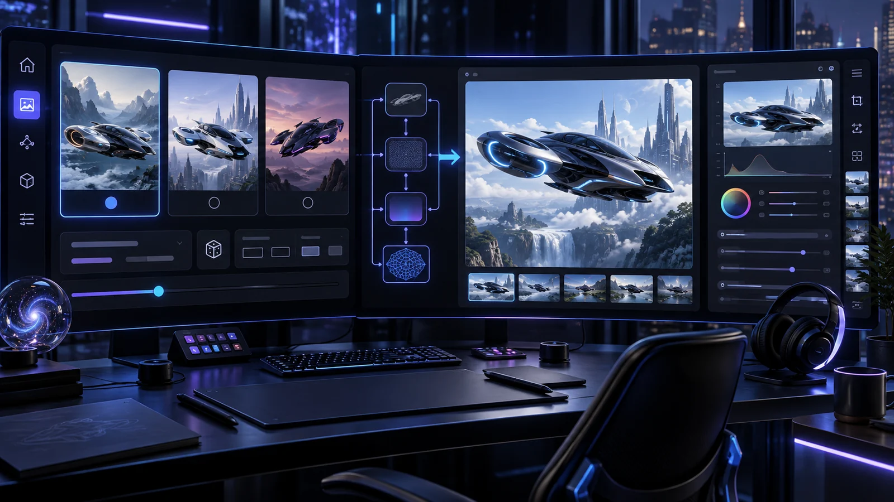

HAL supports direct rendering and a controlled three-prompt workflow:

```text
natural idea
  → three distinct prompt cards
  → choose 1, 2, 3, a subset or all
  → choose workflow, model, LoRA, strength, size, ratio and seed
  → render status and result cards
  → repeat, revise or open selected images in Photoshop
```

The workflow UI adapts to the selected model. Pic-to-pic adds an upload preview; PictoFlux2 adds character-preserving edit strength and reproducible seed control; MiniMax H3 adds duration, format, first and optional last frame, Turbo settings and native audio direction.

## Production accelerators

These tools were built for **our own software production**. Creating consistent character states, animation frames and controlled edits repeatedly by hand was slowing down the pipeline. HAL now turns those recurring steps into named, reproducible jobs without hiding the creative controls.

### Avatar Factory — one source, 18 aligned states

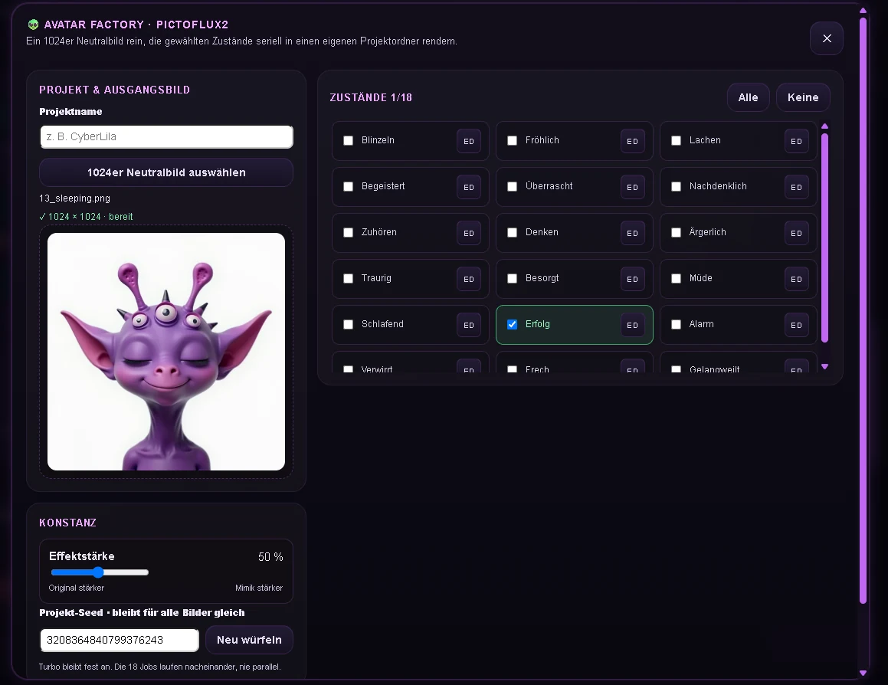

The Avatar Factory turns one validated square **1024 × 1024 neutral portrait** into a complete expression pack for our software avatars:

1. Load the neutral character and name the project.
2. Select any combination of 18 production states such as blinking, happy, listening, thinking, angry, sleeping, alarmed or bored.
3. Open **ED** beside any state to inspect, change and save its actual generation instruction.
4. Choose effect strength and a shared project seed to preserve visual continuity.
5. Submit memory-safe Turbo jobs sequentially and collect every result in one named project folder.

A fixed production guard tells the model to preserve character identity, exact position, image dimensions and lighting while changing only the requested expression. The resulting pack is ready for background removal, interpolation and integration into HAL, CyberBuddy or another character-driven application.

### MiniMax H3 — directed animation and video

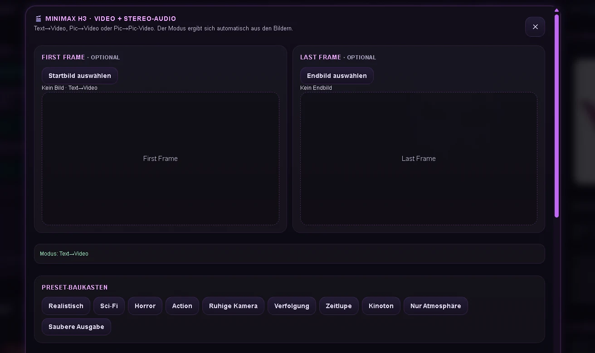

The H3 studio supports **text-to-video, image-to-video and first-to-last-frame video** with native stereo audio. Instead of putting an entire production brief into one opaque text area, HAL separates it into reusable blocks:

```text
visual look
  + scene and action
  + timed storyboard
  + camera direction
  + dialogue / sound effects / music
  + exclusions
  → one clean model prompt
```

Preset buttons provide useful starting points while aspect ratio, megapixels, duration, random or fixed seed, Turbo strength and Turbo steps remain directly adjustable. German descriptions are translated only when useful; already suitable English prompt material is not rewritten unnecessarily.

### PictoFlux2 — character-preserving image edits

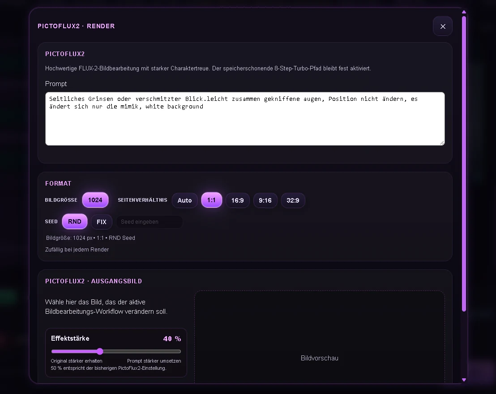

PictoFlux2 is the fast editing path behind the character workflow. It accepts a source image plus a focused change request and provides:

- an effect-strength slider for balancing identity retention against edit intensity;
- format and aspect-ratio controls;
- random or fixed seeds for comparable, repeatable iterations;
- a memory-safe eight-step Turbo path for local production batches;
- a full result preview that can feed avatar packs, animation frames or the wider render workflow.

Together, the three tools form a practical loop: **PictoFlux2 develops and corrects the character, Avatar Factory produces its expression vocabulary, and MiniMax H3 brings selected frames to life.**

## Context, dossiers and desktop actions

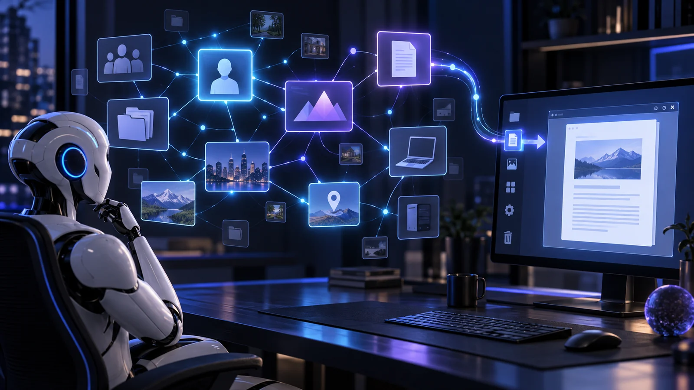

HAL combines two kinds of memory:

- **Recent conversation context** keeps the current exchange coherent.
- **Structured dossiers** store durable knowledge about people, projects, places, vehicles, devices and open topics.

Matching terms retrieve a compact summary first. Deeper sections are loaded only when needed, avoiding unnecessary context. That allows reactions such as:

> “Klaus is here.”<br>
> “Has he already sold one of the cars?”

Approved desktop actions use a managed program list. HAL can launch configured applications, ask which Photoshop format is required, create A4/Full HD/4K documents and hand selected render results to Photoshop.

## Commodities DEMO cockpit

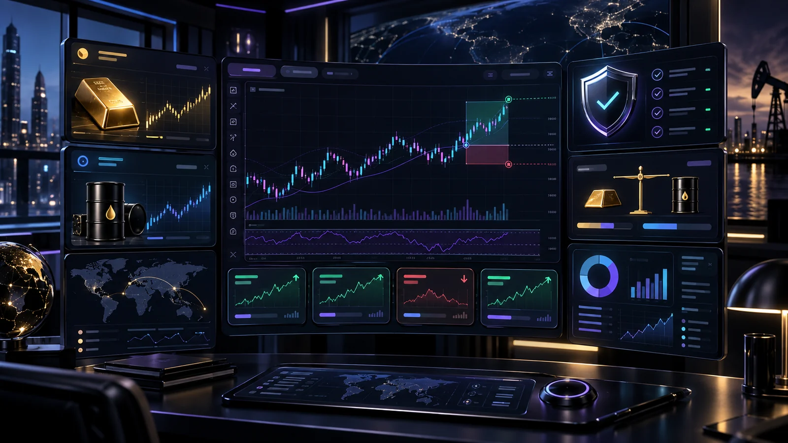

The commodities runner focuses on Gold and Crude Oil in Capital.com **DEMO** mode:

1. Scan configured markets for confirmed pullbacks and local zones.
2. Check spread, direction, reward potential, stop risk and free trade slots.
3. Reserve an entry before order submission to prevent duplicate placements.
4. Attach stop, target and maximum holding time.
5. Reconcile local state against broker positions before further entries.
6. Import the broker's final booking value when the trade closes.

Configurable guardrails include position value, concurrent trades, per-trade loss, session target, daily loss, order-attempt limit and emergency close. Results and exit reasons remain visible in the trade ledger.

## Supporting systems

| System | What it adds |
|---|---|
| **Avatar Factory** | Batch production of 18 aligned facial states with editable prompts, shared seed and project folders |
| **PictoFlux2** | Character-preserving image edits with effect strength, format, ratio, seed and Turbo controls |
| **MiniMax H3** | Text-, image- and first/last-frame video with prompt blocks, presets, Turbo and native stereo audio |
| **Vision and files** | Screenshot, photo, code and text analysis; combined reasoning across multiple uploads |
| **Photoshop bridge** | Document creation plus opening selected completed renders |
| **Desktop launcher** | Voice-driven starts from an explicit managed application list |
| **API cost ledger** | Daily spend grouped by model, endpoint and purpose |
| **Render history** | Reopen, edit and rerender old prompts or pass their result to Photoshop |

## Real interface captures

The showcase includes a guided tour of the running interface rather than relying only on concept art. All 22 current captures are presented in a consistent frame and can be opened full-size on the website.

| Command center | Creative results |
|:---:|:---:|
| 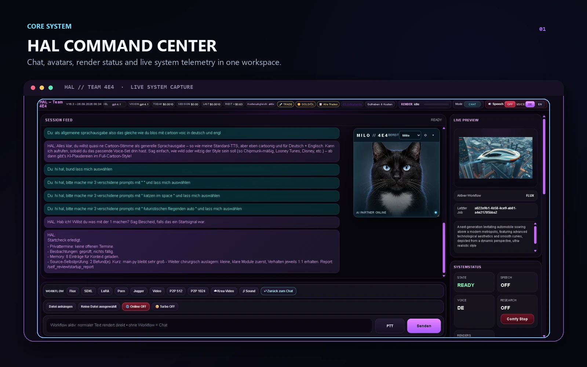 | 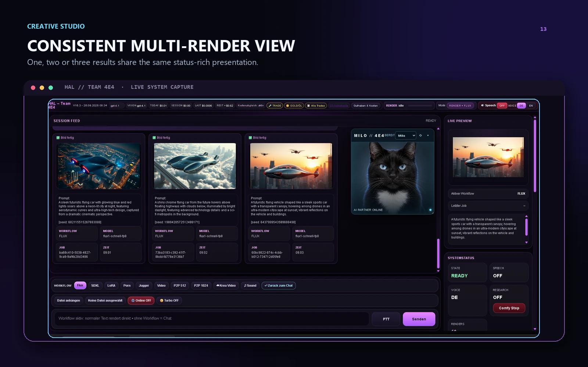 |

| Knowledge admin | Broker reconciliation |
|:---:|:---:|
| 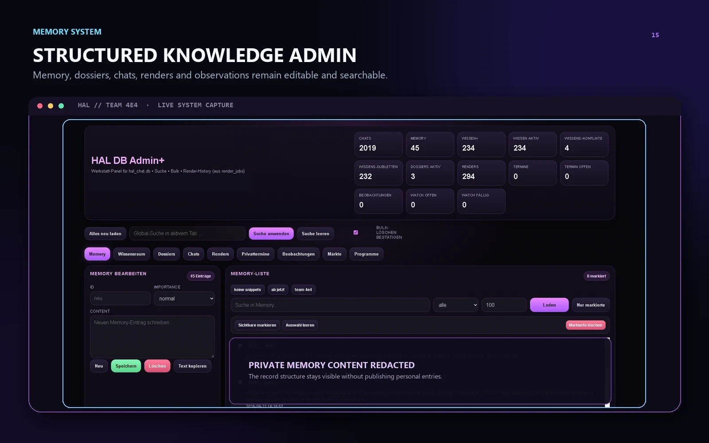 | 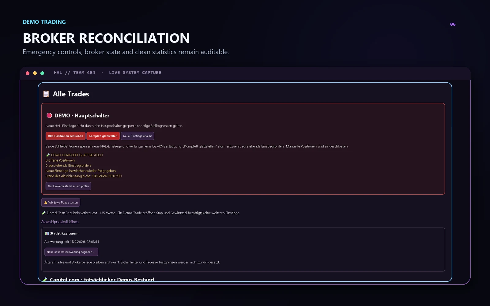 |

The complete tour covers:

- the central conversation, avatar, preview and status cockpit;
- model-aware Flux setup, three-prompt choice, result comparison and post-render routing;
- Avatar Factory batch selection, per-state prompt editing and stable project controls;
- MiniMax H3 first/last-frame animation, block-based prompt direction and visible Turbo controls;
- PictoFlux2 character-preserving edits, strength, format and seed controls;
- the day-by-day API cost ledger;
- allowlisted voice program launching and Photoshop document presets;
- searchable memory, dossiers, chats, renders and observations;
- general and commodity-specific DEMO trade presets, pre-entry checks, emergency controls, broker reconciliation and the traceable trade ledger.

## Request flow

```text
voice / text
    ↓
intent + tone
    ↓
recent context + relevant dossiers
    ↓
specialized tool or workflow
    ↓
one coherent response
    ↓
voice + visemes + facial performance
```

Example:

> “HAL, make me three prompts for a futuristic flying car and let me choose.”

HAL returns three prompt cards. Guido chooses `1`, `2`, `3`, a subset or all. Only then does the selected workflow open with image size, aspect ratio and seed controls.

## Project principles

1. **Local** — private configuration and operational state stay on the user's system.
2. **Visible** — actions, costs, render progress and broker results remain inspectable.
3. **Modular** — characters and focused tools can evolve independently.
4. **Human** — the interface stays understandable, collaborative and occasionally funny.

## Safety and privacy

This repository is a visual showcase. It contains **no API keys, broker credentials, databases, account state, private memory or runtime logs**. The trading integration described here is restricted to Capital.com **DEMO** mode.

---

**Team 4E4** · People · Ideas · AI · Real Impact
